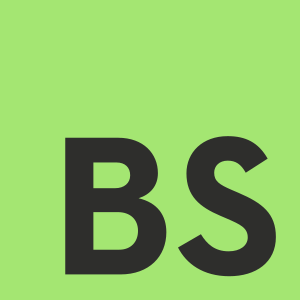

  
  <h1 align="center">BobaScript</h1>

  
  
  
  

a nice, cold, refreshing scripting language built in Rust, with some fun little gimmicks!

## tell me more

ok here's the jist of my plans:

- **inspired by TypeScript and Rust!** has very Rust-like syntax and is expression-based, but has modern JavaScript-like elements such as tuples and records. a type system like TypeScript's is planned!
- **built with several use-cases in mind!** from embedding it in your own app to building web apps in it, BobaScript has you covered! build server side rendered apps PHP-style using BSX, or compile it to either WASM or modern JavaScript!
- **we don't know the concept of null values!** I've never even heard of them, personally! in this language anything that doesn't return a value just returns an empty tuple by default! I also plan on introducing `Option` types when the type system gets thrown in.

these are all subject-to-additions as I work on this, but never removals or changes! I, the person who hasn't worked in lang dev before, will be stubbornly sticking to my guns on at least those three points

## this is ridiculous and pointless

that's just, like, your opinion, man!
